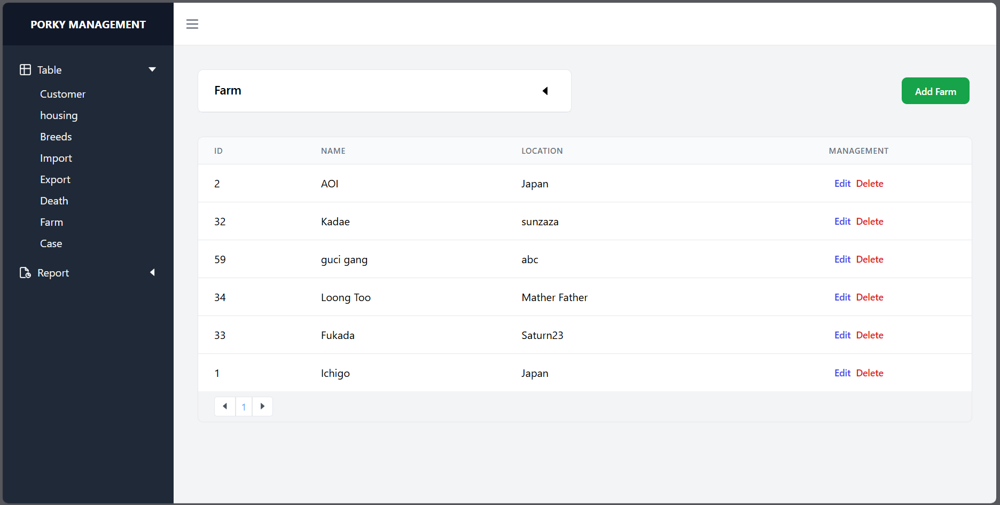
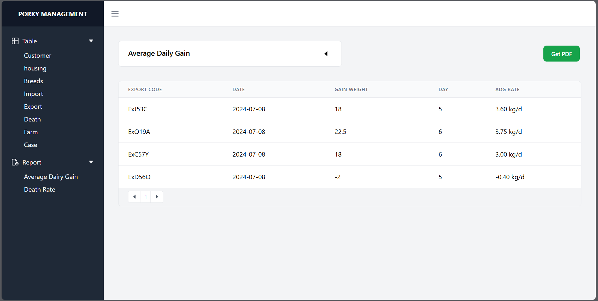
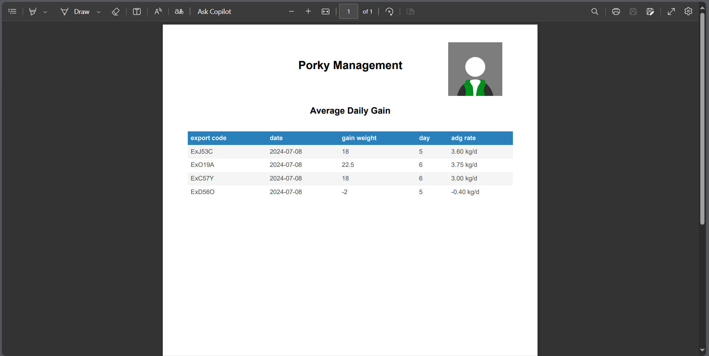
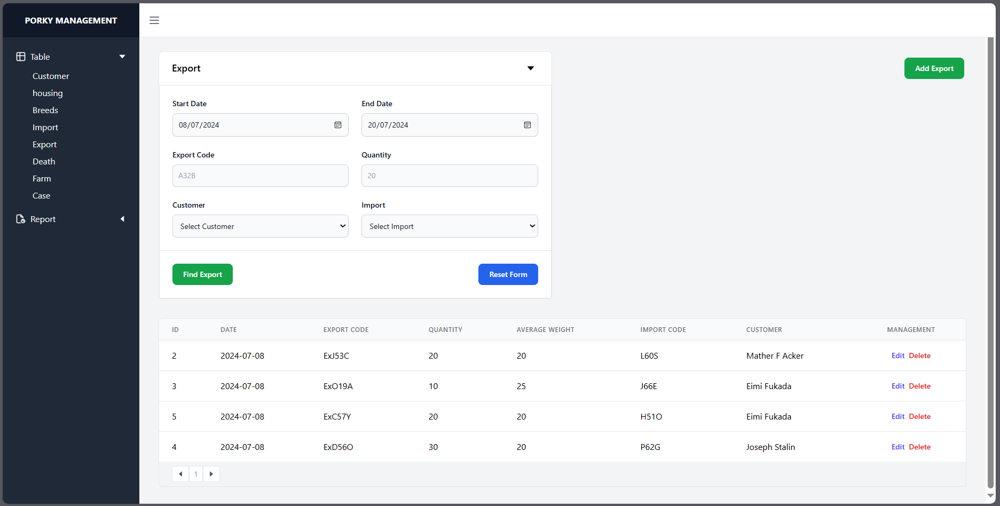
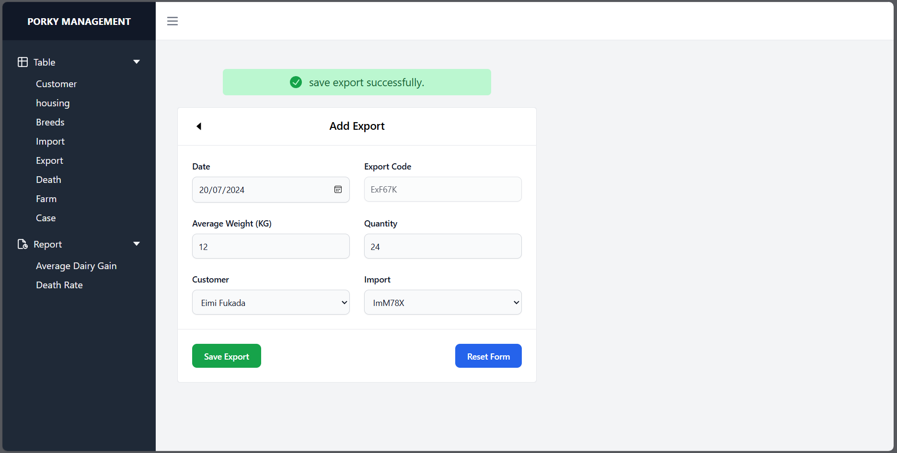
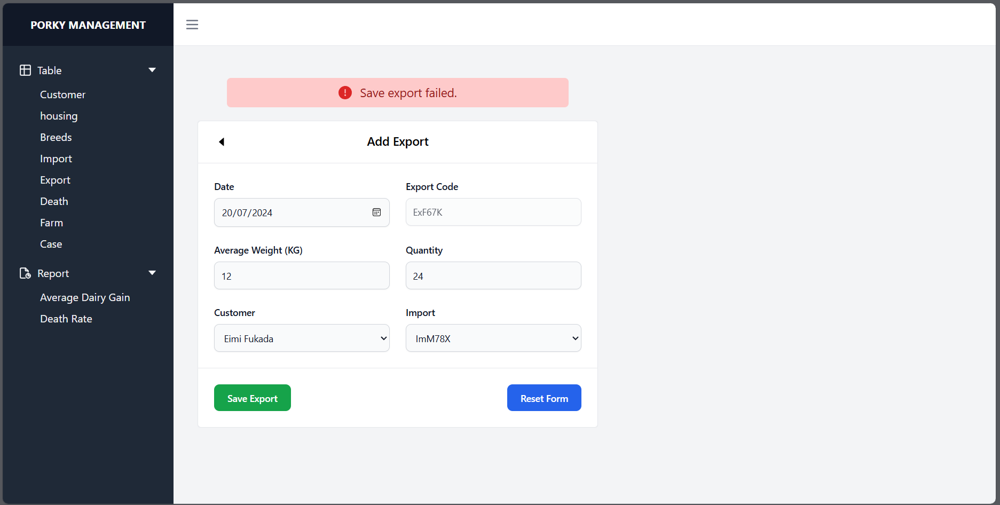

# Porky Management
## The GUI For Database Management

This project is designed for database information management using React.js, Tailwind CSS, and i18n. It also utilizes AutoTable for PDF generation.

### Deployment GUI Only
https://porky-management.onrender.com/

## Previews

### Index

### Report

### Generate PDF

### Data Management

#### Search Information

#### Save Validate Information

#### Save Invalidate Information
